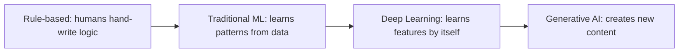
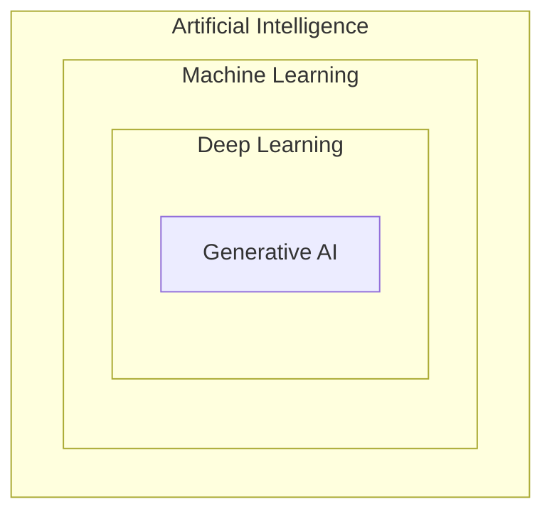
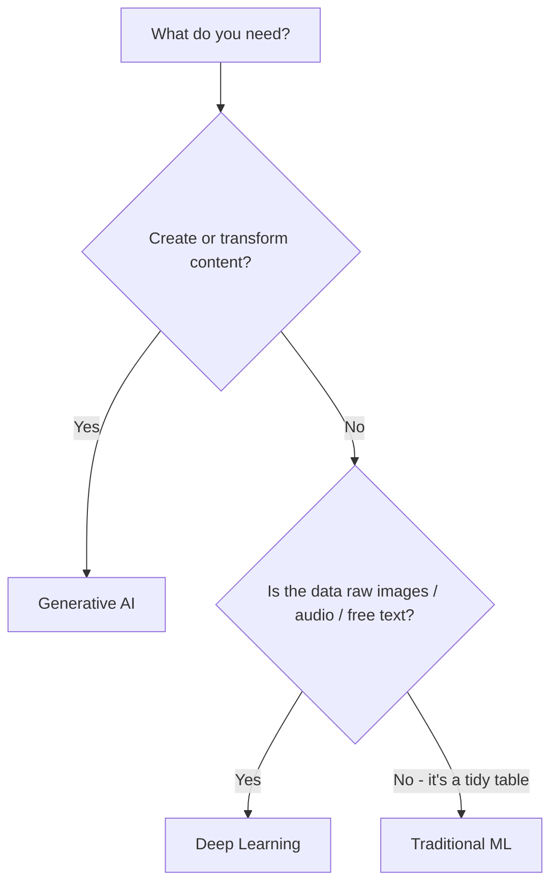
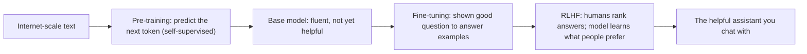
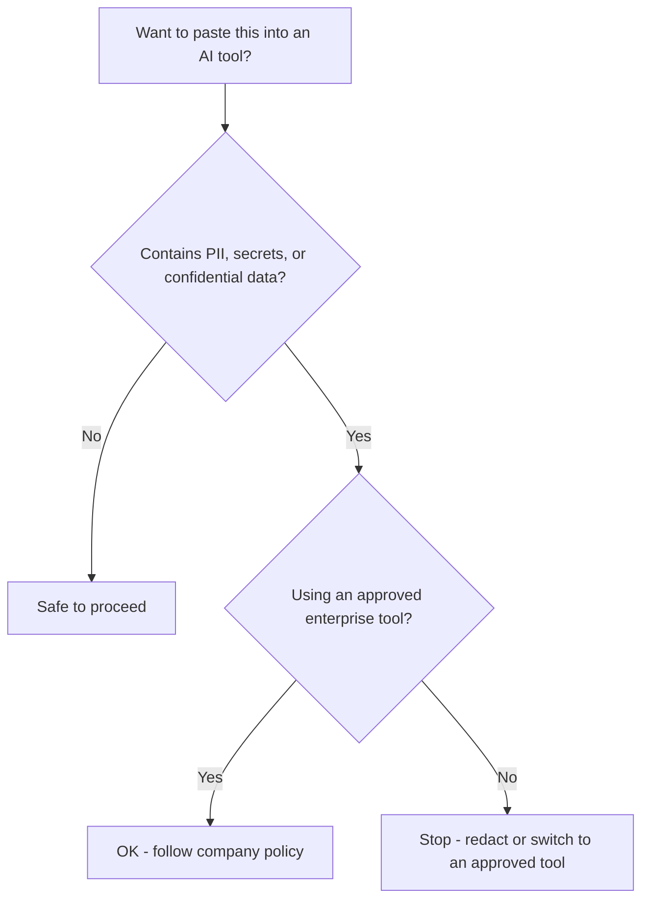

# AI Training Platform - Curriculum (v2, working draft)

Status: Level 1 drafted as a depth + style sample for review. Levels 2-12 will follow the same standard once approved. This file is the content source of truth; the platform renders it as interactive, visual lessons.

---

## How to read this doc

On-screen copy is terse, but the teaching is not shallow. We open simple and relatable to earn attention, then go genuinely deep into how things work - depth delivered as layered, digestible pieces, each carried by a visual. Markers used per lesson:

- `Objectives` - what the learner can do afterward.
- `Hook` - the one-line opener that earns attention.
- `Example` - a real, relatable scenario (the simple idea).
- `How it works` - the depth layer: the actual mechanism, built up step by step.
- `When to use / trade-offs` - practical decision-making (where relevant).
- `[VISUAL: ...]` - a diagram/animation the platform renders. A `mermaid` block or table shows the intended visual.
- `[INTERACTIVE: ...]` - a hands-on widget. The text defines what the learner does and learns.
- `[EXPAND: Go deeper]` - optional advanced nuance, hidden by default (progressive disclosure) so the main path stays clean.
- `Quiz` - 3 checks, including one application question, with answers and a one-line why.
- `Recap` - three takeaways.
- `Artifact` - (when present) a reusable output that flows into the learner's Portfolio.

---

## Content design principles (non-negotiable)

Applied to every single lesson:

1. Visual-first: every concept is paired with a diagram, animation, table, or annotated visual. Show, don't tell.
2. Layered depth: open simple and relatable, then go deeper into how it actually works. Depth is mandatory - but delivered as small, sequential, digestible pieces, never as walls of text. Use `[EXPAND: Go deeper]` for advanced nuance.
3. Low-text per step: short chunks, plain language, one idea at a time. Length comes from more layers, not denser paragraphs.
4. Interactive by default: at least one hands-on element per lesson. Never passive reading.
5. Relatable: everyday and workplace analogies, before/after scenarios, real cases - over abstract theory.
6. Examples beside definitions: definitions and explanations matter and stay - but every one is immediately paired with at least one concrete example relatable to the reader. Never ship a bare definition.
7. Logical and progressive: a clear path from intuition to mechanism to application. Never assume skipped context; foreshadow where a topic deepens later.

Litmus test: a beginner should feel it was simple; a skeptic should feel it was deep. If a screen is mostly words, rework it into a visual + a short caption + an interaction.

---

## Lesson template + metadata schema

Every lesson is authored against this skeleton.

```
Lesson <level>.<n> - <Title>
Pathways: <which recommended paths include this lesson>
Difficulty: Beginner | Intermediate | Advanced
Time: <~minutes>
Prerequisites: <lesson IDs, or none>
Objectives:
  - After this you can <verb> ...
Body:
  Hook:                 <1-2 lines, simple + relatable>
  Example:              <relatable scenario = the simple idea>
  How it works:         <the depth: mechanism in layered steps; pair every definition with a relatable example; each step has a [VISUAL]>
  When to use / trade-offs: <practical decisions, comparisons (where relevant)>
  [EXPAND: Go deeper]:  <optional advanced nuance>
  [INTERACTIVE]:        <what the learner does + the feedback they get>
Quiz:                   <3 questions incl. one application question; answer + one-line why>
Recap:                  <3 bullets>
Artifact:               <optional portfolio output>
```

Level rule: every level ends with a hands-on mini-project that applies its lessons. Every pathway ends with a capstone.

---

## The 12-level map (skeleton)

Change markers from the original draft: `[NEW]` `[MOVED]` `[RECAST]` `[REORDER]` `[UPDATE]`. Only Level 1 is fully drafted below; the rest are titles pending drafting.

- Level 1 - Generative AI Literacy: 1.1 The AI Shift | 1.2 LLM Mechanics | 1.3 The Boundaries | 1.4 Lightweight Corporate Guardrails
- Level 2 - Applied Prompt Engineering: 2.1 Prompt Mechanics | 2.2 Core Prompting | 2.3 Advanced Frameworks | 2.4 Context Constraints | 2.5 [NEW] Staying Safe: Data Leakage & Prompt-Injection Basics | 2.6 [NEW] Trust but Verify: Fact-Checking AI Output  ([MOVED] Computer Use -> 5.5)
- Level 3 - The AI Economy & Workplace: 3.1 AI Ergonomics | 3.2 Core GenAI Economics | 3.3 Use-Case Discovery | 3.4 AI Change Management
- Level 4 - Next-Gen Model Paradigms: 4.1 Inference-Time Compute | 4.2 Multimodality | 4.3 Model Flavours | 4.4 System Strategy ([UPDATE] model names -> callouts)
- Level 5 - AI Automation Workflows: 5.1 Workflow Design | 5.2 No-Code Automation | 5.3 API & Webhook Connections | 5.4 Human-in-the-Loop | 5.5 [MOVED] Computer Use & Desktop OS Agents | 5.6 AI Workflow ROI
- Level 6 - AI Evaluation & Reliability: 6.1 Benchmark Basics | 6.2 AI Failure Modes | 6.3 Core Measurement Metrics | 6.4 LLM-as-a-Judge | 6.5 [RECAST] Continuous / Production Evaluation & Drift Monitoring
- Level 7 - Spec-Driven Dev & Deep Economics: 7.1 Spec-Driven Development | 7.2 Tool Use Fundamentals | 7.3 MCP | 7.4 Deep GenAI Economics
- Level 8 - Data Foundations & Basic RAG: 8.1 Vector Spaces | 8.2 RAG Architecture | 8.3 Data Preparation | 8.4 Data Governance
- Level 9 - Advanced Retrieval & Search: 9.1 Retrieval Optimisation | 9.2 Advanced Search Patterns | 9.3 Advanced RAG Tactics ([UPDATE] define/replace "DSD") | 9.4 RAG Evaluation
- Level 10 - Autonomous Single-Agent Systems: 10.1 Agent Design & Logic | 10.2 [REORDER] Agent Memory | 10.3 Stateful Graph Orchestration | 10.4 Engineering Lifecycle | 10.5 Execution Controls & Guardrails | 10.6 Agent Evaluation
- Level 11 - Multi-Agent Swarms & Governance: 11.1 Multi-Agent Systems | 11.2 AI Apps Workflows | 11.3 Agent Governance & Liability | 11.4 Deep Corporate Guardrails | 11.5 [NEW] LLM Security & the OWASP LLM Top 10
- Level 12 - Model Adaptation & Deep Architecture: 12.1 Deep Architectures | 12.2 Alternative Paradigms | 12.3 Efficiency, Tuning & Accuracy | 12.4 Infrastructure Operations

Pathways, the prerequisite map, the Portfolio system, the glossary, and the gamification spec are defined in the sections below and as machine-readable data under `content/` (which the platform build will consume).

---

# Level 1 - Generative AI Literacy

For: All roles. The goal is confidence with real understanding - simple on the surface, genuinely deep underneath. Every jargon term gets a plain-English translation the moment it appears.

---

## Lesson 1.1 - The AI Shift

Pathways: All
Difficulty: Beginner
Time: ~12 min
Prerequisites: none
Objectives:
- Explain the four eras of AI and what changed at each step.
- Clearly distinguish Traditional ML, Deep Learning, and Generative AI - how each learns, what it outputs, and its trade-offs.
- Choose the right approach for a given real-world problem.

### Hook
You've used AI for years - spam filters, autocomplete, Netflix picks. So why does ChatGPT feel like a different species?

### Example (the simple idea)
Watch your spam filter evolve:
- 1995: a human wrote rules - "if it says 'free money', block it." Spammers wrote "fr3e m0ney" and walked straight through.
- 2010: it learned from millions of emails what spam looks like - no hand-written rules.
- Today: AI can write the email, reply to it, and summarize the thread.

Each step handed more of the thinking to the machine.

[VISUAL: 4-stage horizontal timeline; a "who does the thinking" bar slides from human toward machine as you advance.]



### How it works: the three types that matter today
Almost everything called "AI" today is one of three things - and they're nested, each a subset of the one before.

[VISUAL: nested rings labelled, from outside in: AI > Machine Learning > Deep Learning > Generative AI.]



1) Traditional Machine Learning
- What: algorithms that learn patterns from mostly structured (table-like) data.
- How it learns: a human chooses the useful columns - "features" like income, age, past purchases - and the model finds the relationship. That hand-picking is "feature engineering."
- Output: a number or a label - "85% likely to churn", "fraud / not fraud".
- Examples: credit scoring, fraud detection, demand forecasting.
- Names you'll hear: logistic regression, decision trees, random forests, gradient boosting.

2) Deep Learning
- What: neural networks with many stacked layers. A subset of ML.
- How it learns: feed it raw, messy data (pixels, audio, text) and it discovers the useful features by itself - no manual feature engineering.
- Output: still usually a label/number, but on unstructured data - "this scan shows a tumor", "this audio says 'hello'".
- Cost: needs lots of data and serious compute (GPUs).
- Examples: image recognition, speech-to-text, translation.

3) Generative AI
- What: deep learning trained to generate brand-new content, not just label things. A subset of deep learning.
- How it learns: trained on enormous amounts of unlabelled data by predicting missing/next pieces ("self-supervised") - so humans don't have to label everything.
- Output: new content - text, images, audio, video, code.
- Superpower: one general model handles many tasks it was never explicitly trained for.
- Examples: ChatGPT, image generators, coding assistants.

[VISUAL: a 3-column strip - "what goes in -> what it figures out -> what comes out" - filled for each of the three.]

One scenario, three approaches (so the difference clicks): imagine a pile of customer reviews.
- Traditional ML: from a table (star rating, review length, "verified buyer?") it predicts a 1-5 satisfaction score.
- Deep Learning: reads the raw review text and classifies each as positive / negative / mixed.
- Generative AI: writes a personalized reply to each unhappy reviewer, plus a one-paragraph summary of the week's themes.

Same data, three different jobs - predict, classify, create.

### When to use which
[VISUAL: comparison table, rendered as a clean scannable card grid.]

| Question | Traditional ML | Deep Learning | Generative AI |
|---|---|---|---|
| Data type | Structured tables | Unstructured (images, audio, text) | Unstructured, general |
| Who finds the features | You (manual) | The model | The model |
| Typical output | Number / label | Number / label | New content |
| Data + compute needed | Low | High | Very high |
| Easy to explain "why"? | Often yes | Hard | Hard |
| Best for | Predicting from tidy data | Perception tasks | Creating, summarizing, reasoning over language |

Rule of thumb:
- Tidy spreadsheet + need a prediction you can explain -> Traditional ML.
- Raw images/audio + need recognition -> Deep Learning.
- Need to create, rewrite, summarize, or converse -> Generative AI.

[VISUAL: a 2-question decision tree.]



[EXPAND: Go deeper]
- "Deep" just means many layers: early layers catch simple patterns (edges), later layers catch complex ones (faces).
- GenAI's leap came from the "transformer" architecture (2017) - you'll meet it properly in Level 12.
- GenAI can be wrong precisely because it generates plausible content rather than looking facts up (Lesson 1.3).
- Many real products combine these: e.g. traditional ML scores risk, GenAI writes the customer explanation.

### [INTERACTIVE: "Pick the right tool"]
Six real scenarios appear: flag fraud in a payments table, transcribe support calls, draft personalized sales emails, forecast next quarter's demand, spot defects in product photos, summarize 100-page contracts. Drag each onto Traditional ML / Deep Learning / GenAI. Instant feedback explains the why and flags common mismatches (e.g. "using GenAI to score fraud on tabular data is slow and hard to audit - traditional ML fits better").

### Quiz
1. The key difference between Traditional ML and Deep Learning is:
   - A) DL only works on spreadsheets  B) DL learns the features itself from raw data  C) ML is always more accurate
   - Answer: B - in traditional ML, humans hand-pick features; DL learns them.
2. (Application) You have a clean customer table and need an explainable "will they churn?" score. Best fit?
   - A) Traditional ML  B) Generative AI  C) Deep Learning
   - Answer: A - structured data plus a need for explainability.
3. Generative AI is best described as:
   - A) a subset of deep learning that creates new content  B) a rules engine  C) a database lookup
   - Answer: A.

### Recap
- AI evolved: rule-based -> traditional ML -> deep learning -> generative AI, each handing more thinking to the machine.
- They're nested: GenAI is deep learning; deep learning is ML; ML is AI.
- Match the tool to the job: tidy/explainable -> ML; perception on raw data -> DL; creating content -> GenAI.

---

## Lesson 1.2 - LLM Mechanics

Pathways: All
Difficulty: Beginner
Time: ~12 min
Prerequisites: 1.1
Objectives:
- Explain what a token is and how an LLM turns text into tokens.
- Describe next-token prediction and why "temperature" changes answers.
- Explain pre-training vs post-training (including RLHF) in plain terms.
- Say what "billions of parameters" means and why scale matters.

### Hook
Your phone's keyboard guesses your next word. An LLM is that same idea - scaled to most of the internet and billions of tiny dials.

### Example (the simple idea)
Type "I'm running late, I'll be there in ___" and your keyboard offers "5", "10", "a". It's predicting what usually comes next. An LLM does this for whole paragraphs, emails, and code.

### How it works
Four layers, each builds on the last.

1) Tokens - what the model actually reads
- Models don't see letters or whole words; they see "tokens" - chunks of roughly 4 characters (~0.75 of a word). "unbelievable" might split into "un", "believ", "able".
- Why it matters: cost and length limits are counted in tokens (you'll use this in Levels 3 and 7).

[VISUAL: a sentence snapping into coloured token chips with a live token counter.]

2) Next-token prediction - how it generates
- At each step the model assigns a probability to thousands of possible next tokens, then samples one, then repeats.
- Example: after "The capital of France is", the token "Paris" gets a huge probability and "banana" gets almost none - so it writes "Paris."

[VISUAL: a bar chart of candidate next tokens with percentages; one gets picked and the sentence grows.]

3) Temperature - the randomness dial
- Low temperature = pick the most likely token (focused, consistent, can be repetitive).
- High temperature = take more chances (creative, but riskier).
- Example: prompt "a tagline for a coffee shop." Low temp -> "Great coffee, every day." High temp -> "Sip the sunrise." Same request, very different energy.

[VISUAL: the same probability bars; a slider makes them "peaky" (low temp) or "flat" (high temp).]

4) How it learned - two phases

- Pre-training: read trillions of words, just predicting the next token. No labels needed (self-supervised). Builds raw language skill and world knowledge.
- Post-training (Fine-tuning + RLHF): coach it to be helpful, honest, and safe. RLHF = humans compare answers, and the model learns which responses people prefer.

5) Scale and parameters
- "Parameters" are the model's adjustable dials, set during training. Modern models have billions of them.
- More parameters + more data + more compute -> more capability. That is the "scaling" story behind the leaps you've seen.

[VISUAL: a tiny network with a few knobs beside a huge one with billions.]

[EXPAND: Go deeper]
- LLMs are "stateless": each request re-reads the whole conversation; they don't remember you between chats unless the app stores history (Level 10, Memory).
- The same prompt can give different answers because of sampling/temperature.
- Knowledge is frozen at the training cutoff unless the model is given live tools or search (Level 8, RAG).

### [INTERACTIVE: "Be the model"]
Shown "The weather today is ___" with weighted options. Pick one and the app reveals the real probabilities, then a temperature slider lets you feel focused vs creative output as you build the sentence.

### Quiz
1. An LLM reads text as:
   - A) whole words  B) tokens (chunks of characters)  C) individual letters only
   - Answer: B.
2. Raising the temperature tends to make answers:
   - A) more focused/predictable  B) more random/creative  C) faster
   - Answer: B.
3. (Application) Your team gets slightly different answers each run and wants more consistency. The simplest lever is:
   - A) lower the temperature  B) add more parameters  C) retrain the model
   - Answer: A.

### Recap
- LLMs work in tokens, predicting the next one from probabilities.
- Pre-training builds knowledge; post-training (fine-tuning + RLHF) makes it helpful.
- Scale drives capability; temperature controls randomness.

---

## Lesson 1.3 - The Boundaries

Pathways: All
Difficulty: Beginner
Time: ~11 min
Prerequisites: 1.2
Objectives:
- Know at a glance what LLMs are great at vs unreliable at - each with an example.
- Explain WHY hallucinations happen (the mechanism, not just the label).
- Identify the main limits: hallucination, bias, knowledge cutoff, weak exact math, context limits, slop - each shown with an example.
- Apply the right mitigation, and the rule: confidence is not correctness.

### Hook
Ask an AI for a source and it may invent one - perfectly formatted, completely fake.

### Example (the simple idea)
Real case: lawyers filed a brief citing court cases an AI generated. The cases didn't exist. They were sanctioned. The model wasn't lying on purpose - it was doing exactly what it does: producing plausible-sounding text.

### What LLMs can and can't do
The big picture first: LLMs are brilliant at working with language, and shaky whenever an answer has to be exactly, verifiably true.

[VISUAL: a two-column "Green zone / Red zone" board; each row is a one-line example you can picture, not just a category.]

Great at (the "green zone"):
- Drafting and rewriting - example: turn 5 messy bullets into a polished client email.
- Summarizing - example: condense a 40-message email thread into 5 takeaways.
- Explaining simply - example: "explain how a mortgage works to a 12-year-old."
- Brainstorming - example: 20 name ideas for a new product launch.
- Translating and reformatting - example: English to Spanish, or raw notes into a clean table.
- Working with text you give it - example: pull every action item out of a pasted meeting transcript.

Unreliable at (the "red zone"):
- Exact facts from memory - example: "what was our Q3 revenue?" - it may confidently invent a number.
- Fresh or real-time info - example: "what's in the news today?" - it's frozen at its training cutoff.
- Precise math and counting - example: "how many r's in 'strawberry'?" - a classic miss.
- Your private/internal data - example: it doesn't know your company wiki or CRM unless you give it access.
- Strict multi-step logic - example: a tricky scheduling puzzle solved in one shot, no working out.
- Knowing its own limits - example: instead of "I don't know," it just answers anyway.

The pattern: language tasks = use freely (and skim). Exact-truth tasks = verify, or give it the facts. The rest of this lesson explains why.

### How it works - why these limits exist
1) Hallucination
- Mechanism: the model predicts plausible tokens. When it lacks a fact, it fills the gap with something that looks right - there's no built-in "I checked this" step.
- Highest risk: niche or recent topics, exact numbers, names, citations.
- Example: ask for "three studies on remote-work productivity" and it returns three real-sounding titles, authors, and years - two of which were never written.

[VISUAL: a "fact gap" where the model bridges a missing fact with a smooth but wrong guess.]

2) Bias
- Mechanism: trained on human-written internet text, so it absorbs human biases and over-represents majority views.
- Shows up as: stereotyping, skewed defaults, uneven quality across languages and groups.
- Example: ask it to "describe a nurse and a CEO" and, unprompted, it may default the nurse to "she" and the CEO to "he."

3) Knowledge cutoff and no live data
- It only "knows" up to its training cutoff, and can't see today's news or your private documents unless connected to tools/search (Level 8, RAG).
- Example: ask "who won last night's game?" and it either guesses or answers about an event from months before its cutoff.

4) Weak at exact math, counting, and strict logic - by default
- It's matching language patterns, not running a calculator, so it can fumble arithmetic or "count the letters" tasks - unless it works step by step or uses tools (Level 2 Chain-of-Thought; Level 4 reasoning models).
- Example: "how many r's are in 'strawberry'?" has tripped up many models (it's 3), and long multiplications can come out subtly wrong.

5) Context limits
- It can only hold so much text at once; very long inputs get truncated or key details get lost (Level 2, "lost in the middle").
- Example: paste a 60-page policy and ask about one clause on page 30 - it may miss it entirely while sounding certain.

6) AI slop
- Mass, low-effort generated content. Beyond being low value, it pollutes the web - and future training data - creating a feedback loop.
- Example: those near-identical "10 Best..." blog posts and generic motivational LinkedIn posts that use many words to say nothing.

[VISUAL: a "confidence vs correctness" gauge - the confidence needle pins high while a separate correctness light stays independent.]

### When to use / how to mitigate
- Verify anything that matters against a trusted source (Lesson 2.6 teaches the technique).
- Give it the facts - paste the source or use retrieval - instead of trusting its memory.
- For logic/math, ask for steps or use a reasoning model/tool.
- Read confident tone as style, not proof.

[EXPAND: Go deeper]
- "Calibration" = whether a model's confidence matches its accuracy; LLMs are often over-confident.
- "Sycophancy": models tend to agree with you - watch for it when you lead the question.
- Asking the model to critique its own answer can surface errors (a preview of self-evaluation in Level 6).

### [INTERACTIVE: "Spot the hallucination"]
Read three AI answers to one question; flag the one with a fabricated fact. Feedback reveals the tells (oddly specific, unverifiable, too-perfect) and which mitigation would have caught it.

### Quiz
1. Hallucinations mainly happen because the model:
   - A) is broken  B) generates plausible text and fills gaps with no fact-check  C) runs out of memory
   - Answer: B.
2. Out of the box, LLMs are least reliable at:
   - A) writing fluent sentences  B) exact arithmetic and counting  C) rephrasing text
   - Answer: B.
3. (Application) You need an AI summary of a brand-new internal report. To avoid hallucination you should:
   - A) trust it if it sounds confident  B) paste the report in / use retrieval so it works from the real text  C) raise the temperature
   - Answer: B.

### Recap
- LLMs predict plausible text, so they can hallucinate, carry bias, and miss recent or private facts.
- By default they're weak at exact math/counting and limited by context size.
- Verify what matters, supply the facts, and never mistake confidence for correctness.

---

## Lesson 1.4 - Lightweight Corporate Guardrails

Pathways: All
Difficulty: Beginner
Time: ~10 min
Prerequisites: none
Objectives:
- Decide what is safe to put into which AI tool, and why.
- Recognize PII and understand where your data can end up.
- Apply practical safe patterns: redact, approved tools, data tiers.

### Hook
Before you paste that customer list into a public chatbot - where does that text actually go?

### Example (the simple idea)
An employee pastes a confidential contract into a free consumer chatbot to "just summarize it." On some consumer tiers, inputs can be retained and reviewed to improve the model. That contract now sits outside company control. Treat a public AI tool like a postcard - assume someone could read it.

### How it works - what happens to your data
1) Consumer vs enterprise tiers
- Consumer/free tools may retain your inputs and, depending on settings, use them to improve models.
- Enterprise/approved tools usually carry "no-training" agreements, data deletion, and access controls.

[VISUAL: two pipelines side by side - "public tool: your text -> may be stored / used" vs "approved tool: your text -> isolated, not trained on".]

2) What counts as sensitive (don't expose)
- PII (Personally Identifiable Information): names, emails, phone, addresses, government IDs, health, payment data.
- Secrets: passwords, API keys, restricted source code.
- Confidential business: client data, contracts, unreleased financials, strategy.

[VISUAL: an icon grid of sensitive categories, each stamped with a "no-enter" badge.]

3) The rules exist for a reason (light touch)
- Laws such as GDPR and CCPA govern personal data, and mishandling carries real penalties. You'll go deeper on this in the Legal/Risk path.

### When to use / safe patterns
- Redact or anonymize before pasting (swap names/numbers for placeholders).
- Use the company-approved tool/tier for anything non-public.
- When unsure, ask - or simply don't paste.
- Example (redaction): instead of "Email john.doe@acme.com about overdue invoice 4471 for $12,300," paste "Email [CUSTOMER] about overdue invoice [ID] for [AMOUNT]" - you still get a great draft, with zero sensitive data exposed.

[VISUAL: decision tree.]



[EXPAND: Go deeper]
- Data residency/sovereignty: where data is physically stored can be a legal requirement.
- Retention windows: how long a vendor keeps inputs varies - check the tier.
- "Shadow AI": staff using unsanctioned tools is a top enterprise risk - expanded in Level 3.4 and the Legal path.

### [INTERACTIVE: "Paste or Don't Paste?"]
Two-step decision game: first judge whether a snippet is sensitive, then choose the right tool/tier. Snippets include a customer account number, public marketing copy, internal salaries, and a generic how-to question. Feedback explains both the data type and the where-it-goes consequence.

### Quiz
1. A free consumer AI tool is risky for confidential data because:
   - A) it's slower  B) inputs may be retained and used to improve models  C) it costs money
   - Answer: B.
2. Which is PII?
   - A) a published press release  B) a customer's email and account number  C) a generic how-to question
   - Answer: B.
3. (Application) You must summarize a sensitive contract. Best move:
   - A) paste it into any free chatbot  B) use the approved enterprise tool and/or redact sensitive parts  C) screenshot it first
   - Answer: B.

### Recap
- Public tools can retain your inputs - treat them like a postcard.
- Never expose PII, secrets, or confidential data; know your approved tools.
- Redact, use approved tiers, and when unsure, ask.

---

## Level 1 Mini-Project - "AI in your world"

Time: ~12 min. Applies all four lessons; no setup required.

Steps:
1. List 3 AI tools you already use and classify each as Traditional ML, Deep Learning, or Generative AI (from 1.1).
2. Pick one real task at work and decide which of the three approaches fits best - and why (from 1.1).
3. Write one personal safe-use rule you'll follow (from 1.4).
4. Name one AI output you'd verify before trusting, and exactly how you'd check it (from 1.3).

Artifact: a short "AI Starter Reflection" - the learner's first Portfolio entry (lightweight here; later levels produce richer artifacts that build toward the end-to-end case study).

---

## Pathways (optional, all-visible)

Picking a path is optional and skippable. Every level and lesson is visible and doable by anyone; a path is a recommended track plus a progress overlay and capstone - never a gate. An optional placement quiz can suggest a path. Canonical lesson lists live in `content/pathways.json`.

- Frontline & Knowledge Workers - everyday productivity. Capstone: automate one real task in your daily workflow (portfolio: productivity win).
- Business & Product Leaders - AI product & transformation leadership. Capstone: scope a use-case, build a no-code workflow, define KPIs/ROI (portfolio: product case study).
- Technical Builders - full-stack AI engineering (all lessons). Capstone: ship a small RAG-powered agent with an eval harness + guardrails (portfolio: full six-phase case study).
- Legal, Risk & Governance - AI safety & guardrails. Capstone: draft an AI acceptable-use + risk/guardrail policy (portfolio: governance artifact).

## Prerequisite map

Each lesson lists its prerequisites in `content/curriculum.json`. Because paths skip levels, two fixes prevent "cold references":
- Business & Product and Legal paths include a RAG primer (8.1/8.2) before Level 11's "Agent + RAG" content.
- Business & Product include evaluation basics (6.1/6.2/6.4), since their focus claims evaluation and Level 10.6 (Agent Evaluation) depends on it.

Any lesson reachable out of order opens with a one-line recap of the concept it assumes.

## Portfolio system

A first-class section where learners assemble end-to-end case studies from artifacts they produce in lessons and capstones. Flagship = the six-phase Agent Case Study (full template, phase->lesson mapping, and per-path formats in `content/portfolio.json`):

1. Use Case & Business Case
2. Spec-Driven Dev & Architecture
3. Dev Lifecycle & Orchestration
4. Observability & Debugging
5. Evaluation & Golden Dataset
6. Production & Cost ROI

The curriculum "teaches toward" it: each phase is taught before it's needed, and relevant lessons emit the exact artifact each phase requires.

## Glossary

A living, hover-definition glossary; each term links to the lesson that introduces it. Seeded set in `content/glossary.json` (extended as Levels 2-12 are authored). Examples: token, parameter, RLHF, temperature, hallucination, embedding, RAG, agent, MCP.

## Gamification & engagement

Config in `content/gamification.json`: XP for lessons/quizzes/projects, ranks, badges, daily streaks, individual + team/department leaderboards, spaced-repetition review, and shareable per-pathway certificates. Tuned for a corporate setting (team leaderboards drive return visits without individual pressure).

## What's next (build phase)

Level 1 content is approved for now. Levels 2-12 are intentionally placeholders (status "placeholder" in `content/curriculum.json`), to be authored later to the Level 1 standard.

Next steps, in order:
1. Build out the platform - render levels/lessons, quizzes, the optional pathway overlay, the portfolio, and gamification, all driven by the `content/` data files.
2. Review Lesson 1 on the live UI and refine the experience.
3. Author and build the remaining levels and lessons.
