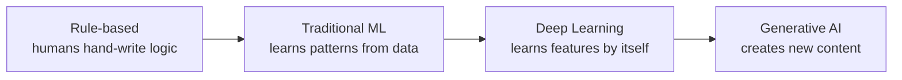
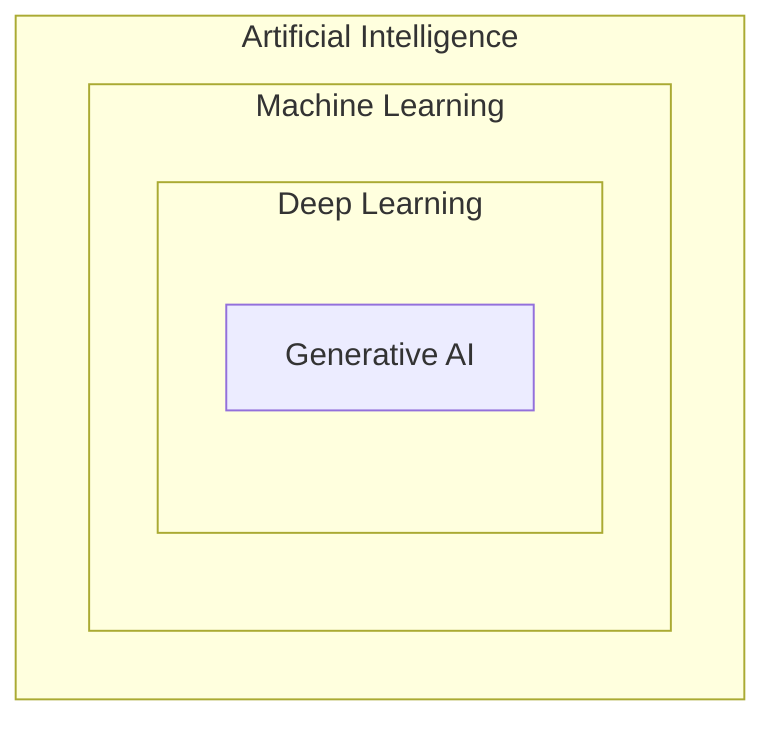
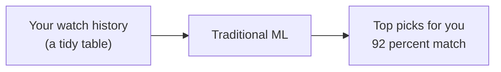
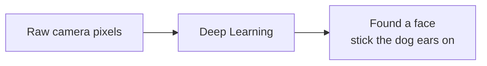
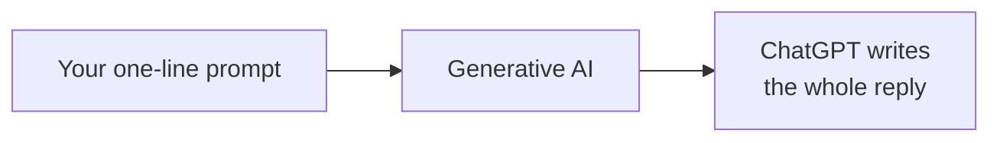
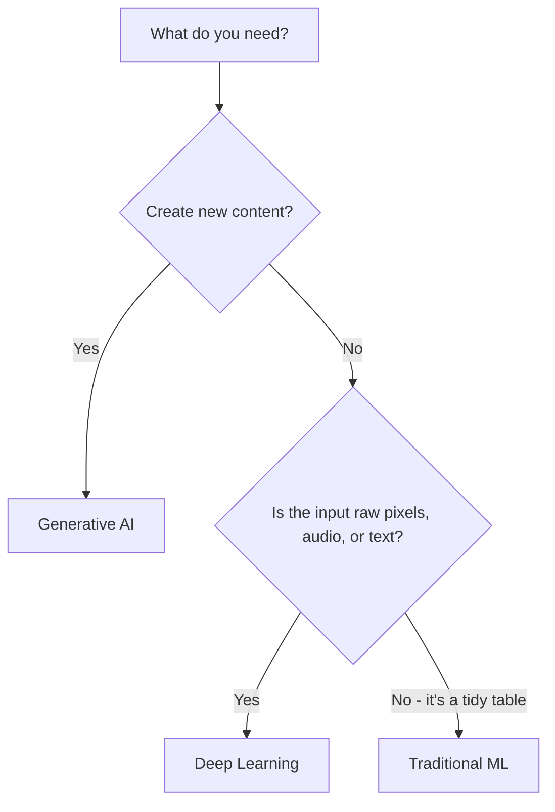

export const meta = {
  id: "1.1",
  summary: "The four eras of AI, and how Traditional ML, Deep Learning, and Generative AI differ.",
  interactiveIds: ["who-does-the-thinking", "guess-the-type", "genai-mythbuster", "pick-the-right-tool"],
};

<Hook>
You&rsquo;ve used AI for years - spam filters, autocomplete, Netflix picks. So why does ChatGPT feel like a different species?
</Hook>

<Example title="The simple idea">

Look at something you do a hundred times a day: finding the answer to a question.

- **Then (rules):** you flipped through an encyclopedia or asked around - you did all the digging yourself.
- **Learned:** Google learned from patterns across billions of pages and ranked the best links for you - but you still had to read them and piece the answer together.
- **Today:** ChatGPT just gives you the answer, written out, in plain words.

Each step handed more of the thinking to the machine.

</Example>

<Visual caption="The four eras: a 'who does the thinking' bar slides from human toward machine.">

</Visual>

<Interactive id="who-does-the-thinking" />

<HowItWorks>The three types that matter today</HowItWorks>

Almost everything called &ldquo;AI&rdquo; today is one of three things - and they&rsquo;re nested, each a subset of the one before.

<Visual caption="Nested rings: AI > Machine Learning > Deep Learning > Generative AI.">

</Visual>

### 1. Traditional Machine Learning

- **What:** algorithms that learn patterns from mostly structured (table-like) data.
- **How it learns:** a human picks the useful columns - <Term k="Feature engineering">&ldquo;features&rdquo; like watch time, genre, time of day</Term> - and the model finds the relationship.
- **Output:** a number or a label - &ldquo;92% match&rdquo;, &ldquo;will watch / won&rsquo;t&rdquo;.
- **Names you&rsquo;ll hear:** logistic regression, decision trees, random forests, gradient boosting.
- **Where you&rsquo;ve seen it:** Netflix&rsquo;s &ldquo;Top picks for you&rdquo; - it learns from the tidy table of what you watched and predicts the next show you&rsquo;ll binge.

<Visual caption="Traditional ML: a table of your history in, a ranked prediction out.">

</Visual>

### 2. Deep Learning

- **What:** neural networks with many stacked layers. A subset of ML.
- **How it learns:** feed it raw, messy data (pixels, audio, text) and it discovers the useful features by itself - no manual feature engineering.
- **Output:** still usually a label/number, but on unstructured data - &ldquo;there&rsquo;s a face, here are the eyes&rdquo;.
- **Cost:** needs lots of data and serious compute (GPUs).
- **Where you&rsquo;ve seen it:** Snapchat&rsquo;s dog-ear filter - raw camera pixels go in, it finds your face and tracks it as you move, and the ears stay glued on.

<Visual caption="Deep Learning: raw pixels in, 'that's a face' out - features found on its own.">

</Visual>

### 3. Generative AI

- **What:** <Term>Deep Learning</Term> trained to generate brand-new content, not just label things.
- **How it learns:** trained on enormous amounts of unlabelled data by predicting missing/next pieces (&ldquo;self-supervised&rdquo;).
- **Output:** new content - text, images, audio, video, code.
- **Superpower:** one general model handles many tasks it was never explicitly trained for.
- **Where you&rsquo;ve seen it:** asking ChatGPT to draft a reply to an awkward text - you give it one line about what you want to say, and it writes the whole message for you, words that never existed before.

<Visual caption="Generative AI: a one-line prompt in, a brand-new written reply out.">

</Visual>

<Interactive id="guess-the-type" />

<Callout type="tip" title="One pile of photos, three jobs">
Open your camera roll - one pile of photos, three totally different AI jobs. 
**Traditional ML** predicts which shots you&rsquo;ll love and auto-favorites them from the metadata. 
**Deep Learning** recognizes faces so you can search &ldquo;all photos of my dog at the beach.&rdquo; 
**Generative AI** turns a selfie into a cartoon or paints in a whole new background. 
Same photos - predict, recognize, create.
</Callout>

<Interactive id="genai-mythbuster" />

<HowItWorks>When to use which</HowItWorks>

<CardTable
  items={[
    {
      name: "Traditional ML",
      accent: "blue",
      attributes: [
        { label: "In one line", value: "Learns patterns from tidy tables to predict a number or label." },
        { label: "Everyday example", value: "Netflix \u201CTop picks for you\u201D" },
        { label: "Reach for it when\u2026", value: "Your data is a clean table and you want an explainable prediction." },
      ],
    },
    {
      name: "Deep Learning",
      accent: "cyan",
      attributes: [
        { label: "In one line", value: "Finds its own features in raw images, audio, or text." },
        { label: "Everyday example", value: "Snapchat face filters" },
        { label: "Reach for it when\u2026", value: "The input is raw pixels, audio, or free text - not a table." },
      ],
    },
    {
      name: "Generative AI",
      accent: "teal",
      highlight: true,
      attributes: [
        { label: "In one line", value: "Creates brand-new content from a prompt." },
        { label: "Everyday example", value: "ChatGPT drafts your reply" },
        { label: "Reach for it when\u2026", value: "You need to make or transform content - text, images, code." },
      ],
    },
  ]}
/>

<Visual caption="A 2-question decision tree.">

</Visual>

<Expand>

- &ldquo;Deep&rdquo; just means many layers: early layers catch simple patterns (edges), later layers catch complex ones (faces).
- GenAI&rsquo;s leap came from the &ldquo;transformer&rdquo; architecture (2017) - you&rsquo;ll meet it properly in Level 12.
- GenAI can be wrong precisely because it generates plausible content rather than looking facts up (Lesson 1.3).
- Many real products combine these: traditional ML scores risk, GenAI writes the customer explanation.

</Expand>

<Interactive id="pick-the-right-tool" />

<Quiz lessonId="1.1" />

<Recap
  items={[
    "AI evolved like finding an answer: encyclopedia/asking around -> Google ranking links -> ChatGPT just answering, each handing more thinking to the machine.",
    "They're nested: GenAI is deep learning; deep learning is ML; ML is AI.",
    "Match the tool to the job: Netflix-style tables -> ML; raw pixels/audio like face filters -> DL; creating content like ChatGPT writing your reply -> GenAI.",
  ]}
/>
