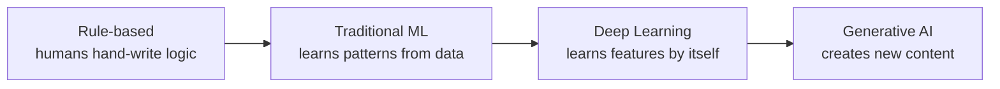
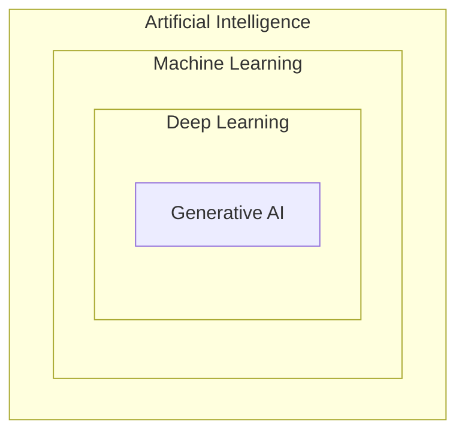
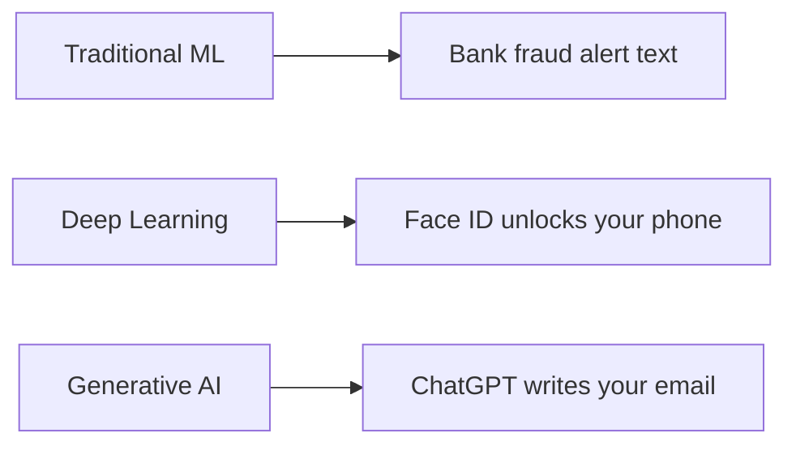
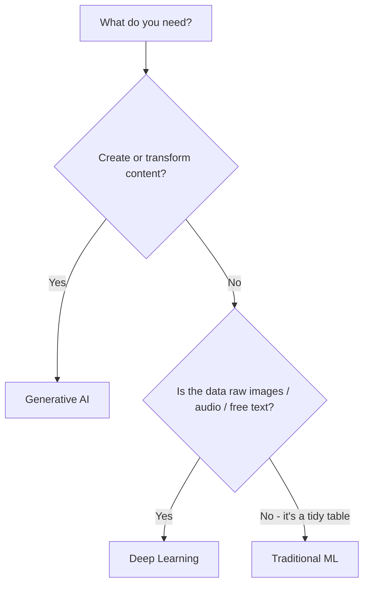

export const meta = {
  id: "1.1",
  summary: "The four eras of AI, and how Traditional ML, Deep Learning, and Generative AI differ.",
  interactiveIds: ["pick-the-right-tool"],
};

<Hook>
You&rsquo;ve used AI for years - spam filters, autocomplete, Netflix picks. So why does ChatGPT feel like a different species?
</Hook>

<Example title="The simple idea">

Watch your spam filter evolve:

- **1995:** a human wrote rules - &ldquo;if it says &lsquo;free money&rsquo;, block it.&rdquo; Spammers wrote &ldquo;fr3e m0ney&rdquo; and walked straight through.
- **2010:** it learned from millions of emails what spam looks like - no hand-written rules.
- **Today:** AI can write the email, reply to it, and summarize the thread.

Each step handed more of the thinking to the machine.

</Example>

<Visual caption="The four eras: a 'who does the thinking' bar slides from human toward machine.">

</Visual>

<HowItWorks>The three types that matter today</HowItWorks>

Almost everything called &ldquo;AI&rdquo; today is one of three things - and they&rsquo;re nested, each a subset of the one before.

<Visual caption="Nested rings: AI > Machine Learning > Deep Learning > Generative AI.">

</Visual>

### 1. Traditional Machine Learning

- **What:** algorithms that learn patterns from mostly structured (table-like) data.
- **How it learns:** a human picks the useful columns - <Term k="Feature engineering">&ldquo;features&rdquo; like income, age, past purchases</Term> - and the model finds the relationship.
- **Output:** a number or a label - &ldquo;85% likely to churn&rdquo;, &ldquo;fraud / not fraud&rdquo;.
- **Names you&rsquo;ll hear:** logistic regression, decision trees, random forests, gradient boosting.
- **Where you&rsquo;ve seen it:** your bank texting &ldquo;Did you just spend $400? Reply YES/NO&rdquo; - it scored one tidy row of your transaction (amount, location, time) and flagged it as odd.

### 2. Deep Learning

- **What:** neural networks with many stacked layers. A subset of ML.
- **How it learns:** feed it raw, messy data (pixels, audio, text) and it discovers the useful features by itself - no manual feature engineering.
- **Output:** still usually a label/number, but on unstructured data - &ldquo;this scan shows a tumor&rdquo;.
- **Cost:** needs lots of data and serious compute (GPUs).
- **Where you&rsquo;ve seen it:** Face ID unlocking your phone, or Google Photos finding every pic of your dog - raw pixels go in, &ldquo;yep, that&rsquo;s them&rdquo; comes out.

### 3. Generative AI

- **What:** <Term>Deep Learning</Term> trained to generate brand-new content, not just label things.
- **How it learns:** trained on enormous amounts of unlabelled data by predicting missing/next pieces (&ldquo;self-supervised&rdquo;).
- **Output:** new content - text, images, audio, video, code.
- **Superpower:** one general model handles many tasks it was never explicitly trained for.
- **Where you&rsquo;ve seen it:** ChatGPT drafting your email or writing an Instagram caption - you type a prompt and it creates words that never existed before.

<Visual caption="Where you've met each one this week: every type maps to something you already use.">

</Visual>

<Callout type="tip" title="One pile of reviews, three jobs">
**Traditional ML** predicts a 1-5 satisfaction score from a table. **Deep Learning** reads the raw text and classifies each review positive / negative / mixed. **Generative AI** writes a personalized reply to each unhappy reviewer. Same data - predict, classify, create.
</Callout>

<HowItWorks>When to use which</HowItWorks>

<CardTable
  items={[
    {
      name: "Traditional ML",
      accent: "blue",
      attributes: [
        { label: "Data type", value: "Structured tables" },
        { label: "Who finds features", value: "You (manual)" },
        { label: "Typical output", value: "Number / label" },
        { label: "Data + compute", value: "Low" },
        { label: "Explain the why?", value: "Often yes" },
        { label: "Best for", value: "Predicting from tidy data" },
        { label: "Everyday example", value: "Bank fraud text alert" },
      ],
    },
    {
      name: "Deep Learning",
      accent: "cyan",
      attributes: [
        { label: "Data type", value: "Unstructured (images, audio, text)" },
        { label: "Who finds features", value: "The model" },
        { label: "Typical output", value: "Number / label" },
        { label: "Data + compute", value: "High" },
        { label: "Explain the why?", value: "Hard" },
        { label: "Best for", value: "Perception tasks" },
        { label: "Everyday example", value: "Face ID / photo search" },
      ],
    },
    {
      name: "Generative AI",
      accent: "teal",
      highlight: true,
      attributes: [
        { label: "Data type", value: "Unstructured, general" },
        { label: "Who finds features", value: "The model" },
        { label: "Typical output", value: "New content" },
        { label: "Data + compute", value: "Very high" },
        { label: "Explain the why?", value: "Hard" },
        { label: "Best for", value: "Creating, summarizing, reasoning over language" },
        { label: "Everyday example", value: "ChatGPT drafts a reply" },
      ],
    },
  ]}
/>

<Visual caption="A 2-question decision tree.">

</Visual>

<Expand>

- &ldquo;Deep&rdquo; just means many layers: early layers catch simple patterns (edges), later layers catch complex ones (faces).
- GenAI&rsquo;s leap came from the &ldquo;transformer&rdquo; architecture (2017) - you&rsquo;ll meet it properly in Level 12.
- GenAI can be wrong precisely because it generates plausible content rather than looking facts up (Lesson 1.3).
- Many real products combine these: traditional ML scores risk, GenAI writes the customer explanation.

</Expand>

<Interactive id="pick-the-right-tool" />

<Quiz lessonId="1.1" />

<Recap
  items={[
    "AI evolved: rule-based -> traditional ML -> deep learning -> generative AI, each handing more thinking to the machine.",
    "They're nested: GenAI is deep learning; deep learning is ML; ML is AI.",
    "Match the tool to the job: tidy/explainable -> ML; perception on raw data -> DL; creating content -> GenAI.",
  ]}
/>
