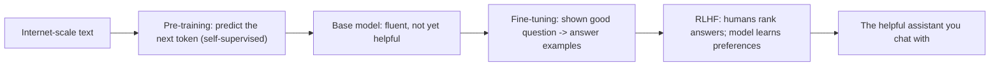

export const meta = {
  id: "1.2",
  summary: "Tokens, next-token prediction, temperature, pre/post-training, and why scale matters.",
  interactiveIds: ["be-the-model"],
};

<Hook>
Your phone&rsquo;s keyboard guesses your next word. An LLM is that same idea - scaled to most of the internet and billions of tiny dials.
</Hook>

<Example title="The simple idea">

Type &ldquo;I&rsquo;m running late, I&rsquo;ll be there in ___&rdquo; and your keyboard offers &ldquo;5&rdquo;, &ldquo;10&rdquo;, &ldquo;a&rdquo;. It&rsquo;s predicting what usually comes next. An <Term k="LLM">LLM</Term> does this for whole paragraphs, emails, and code.

</Example>

<HowItWorks>Four layers, each builds on the last</HowItWorks>

### 1. Tokens - what the model actually reads

Models don&rsquo;t see letters or whole words; they see <Term>token</Term>s - chunks of roughly 4 characters (~0.75 of a word). Cost and length limits are counted in tokens.

<Visual caption="A word snaps into coloured token chips.">

  un
  believ
  able
  = 1 word, 3 tokens

</Visual>

### 2. Next-token prediction - how it generates

At each step the model assigns a probability to thousands of possible next tokens, then samples one, then repeats. After &ldquo;The capital of France is&rdquo;, the token &ldquo;Paris&rdquo; gets a huge probability and &ldquo;banana&rdquo; gets almost none.

### 3. Temperature - the randomness dial

<Term>Temperature</Term> controls how adventurous the sampling is. Low = pick the most likely token (focused, consistent). High = take more chances (creative, but riskier). Prompt &ldquo;a tagline for a coffee shop&rdquo;: low temp &rarr; &ldquo;Great coffee, every day.&rdquo; High temp &rarr; &ldquo;Sip the sunrise.&rdquo;

### 4. How it learned - two phases

<Visual caption="From internet-scale text to a helpful assistant.">

</Visual>

- <Term>Pre-training</Term>: read trillions of words, just predicting the next token. No labels needed.
- <Term>Post-training</Term> (fine-tuning + <Term>RLHF</Term>): coach it to be helpful, honest, and safe.

### 5. Scale and parameters

<Term>Parameter</Term>s are the model&rsquo;s adjustable dials, set during training - modern models have billions. More parameters + more data + more compute &rarr; more capability. That is the &ldquo;scaling&rdquo; story behind the leaps you&rsquo;ve seen.

<Expand>

- LLMs are &ldquo;stateless&rdquo;: each request re-reads the whole conversation; they don&rsquo;t remember you between chats unless the app stores history (Level 10, Memory).
- The same prompt can give different answers because of sampling/temperature.
- Knowledge is frozen at the training cutoff unless the model is given live tools or search (Level 8, RAG).

</Expand>

<Interactive id="be-the-model" />

<Quiz lessonId="1.2" />

<Recap
  items={[
    "LLMs work in tokens, predicting the next one from probabilities.",
    "Pre-training builds knowledge; post-training (fine-tuning + RLHF) makes it helpful.",
    "Scale drives capability; temperature controls randomness.",
  ]}
/>
