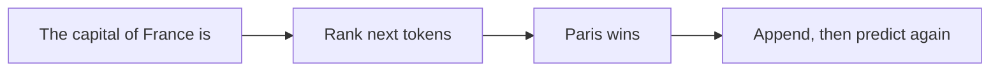
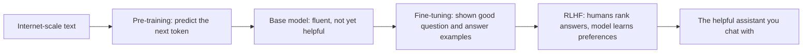

export const meta = {
  id: "1.2",
  summary: "Tokens, next-token prediction, temperature, pre/post-training, and why scale matters.",
  interactiveIds: ["token-splitter", "predict-the-next-token", "be-the-model", "order-the-pipeline"],
};

<Hook>
Your phone&rsquo;s keyboard guesses your next word. An LLM is that same idea - scaled to most of the internet and billions of tiny dials.
</Hook>

<Example title="The simple idea">

Type &ldquo;I&rsquo;m running late, I&rsquo;ll be there in ___&rdquo; and your keyboard offers &ldquo;5&rdquo;, &ldquo;10&rdquo;, &ldquo;a&rdquo;. It&rsquo;s predicting what usually comes next. An <Term k="LLM">LLM</Term> does this for whole paragraphs, emails, and code - and the rest of this lesson is just unpacking how.

</Example>

<HowItWorks>Five ideas, each builds on the last</HowItWorks>

### 1. Tokens - what the model actually reads

Models don&rsquo;t see letters or whole words; they see <Term>token</Term>s - chunks of roughly 4 characters (~0.75 of a word). Everything - cost, speed, and length limits - is counted in tokens, not words.

How does the split happen? The tokenizer learns the most common chunks of text and reuses them. A very common whole word like &ldquo;the&rdquo; or &ldquo;running&rdquo; is usually a single token, while a rarer or longer word gets chopped into smaller sub-word pieces it has seen before - so &ldquo;unbelievable&rdquo; becomes &ldquo;un / believ / able.&rdquo; Spaces and punctuation ride along as part of tokens too, and numbers often split digit-by-digit. (If you want the name for it: this is byte-pair, or sub-word, splitting.)

- **Where you&rsquo;ve seen it:** ever notice ChatGPT has a length limit, or that pasting a long PDF gets it &ldquo;cut off&rdquo; or costs more on the API? That&rsquo;s tokens. Think of a taxi meter ticking up per chunk of text - the longer the ride, the higher the count.

<Visual caption="A rare word gets chopped into sub-word pieces it already knows - 1 word, 3 tokens.">

  un
  believ
  able
  = 1 word, 3 tokens

</Visual>

<Interactive id="token-splitter" />

### 2. Next-token prediction - how it generates

At each step the model assigns a probability to thousands of possible next tokens, samples one, then repeats with the new text. After &ldquo;The capital of France is&rdquo;, the token &ldquo;Paris&rdquo; gets a huge probability and &ldquo;banana&rdquo; gets almost none.

- **Where you&rsquo;ve seen it:** Gmail&rsquo;s Smart Compose. Start typing &ldquo;Let me know if you have any&rdquo; and a grey &ldquo;questions&rdquo; appears ahead of your cursor - you hit Tab and it&rsquo;s right. It&rsquo;s ranking the likeliest next chunk from everything it&rsquo;s read. ChatGPT is that same trick, scaled up and never stopping until the thought is finished.

<Visual caption="Predict one token, append it, predict again - the loop that writes everything.">

</Visual>

<Interactive id="predict-the-next-token" />

### 3. Temperature - the randomness dial

<Term>Temperature</Term> controls how adventurous the sampling is. Low = pick the most likely token (focused, consistent). High = take more chances (creative, but riskier).

- **Where you&rsquo;ve seen it:** hit &ldquo;Regenerate&rdquo; on a ChatGPT answer and you get a freshly-worded reply every time - same prompt, different wording. That reshuffle is temperature: the model re-rolls which likely tokens it picks instead of repeating the exact same sentence.

<Visual caption="Same prompt, two temperatures - focused versus creative.">

  

    
Low temp

    
&ldquo;Great coffee, every day.&rdquo;

  

  

    
High temp

    
&ldquo;Sip the sunrise.&rdquo;

  

</Visual>

Same prompt - &ldquo;a tagline for a coffee shop&rdquo; - the dial just decides how safe or surprising the wording gets.

<Interactive id="be-the-model" />

### 4. How it learned - two phases

Before it could chat, the model went through two very different schools.

- **Where you&rsquo;ve seen it:** picture a brilliant know-it-all who read the entire internet but has no manners - blurts facts, ignores your actual question. Then they go to finishing school, where coaches teach them to actually be helpful, honest, and polite. That second school is what turns raw knowledge into a useful assistant.

<Visual caption="From internet-scale text to a helpful assistant.">

</Visual>

- <Term>Pre-training</Term>: read trillions of words, just predicting the next token. No labels needed - this is where raw knowledge and fluency come from.
- <Term>Post-training</Term> (fine-tuning + <Term>RLHF</Term>): coach it with good examples and human preferences so it becomes helpful, honest, and safe.

<CardTable
  items={[
    {
      name: "Pre-training",
      accent: "blue",
      attributes: [
        { label: "In one line", value: "Reads the internet and learns to predict the next token." },
        { label: "Trained on", value: "Trillions of words of raw text, no labels." },
        { label: "Everyday effect", value: "Fluent and knowledgeable - but a know-it-all with no manners." },
      ],
    },
    {
      name: "Post-training",
      accent: "teal",
      highlight: true,
      attributes: [
        { label: "In one line", value: "Finishing school: coached to be helpful, honest, and safe." },
        { label: "Trained on", value: "Good question and answer examples + human rankings (RLHF)." },
        { label: "Everyday effect", value: "Actually answers your question politely and usefully." },
      ],
    },
  ]}
/>

<Interactive id="order-the-pipeline" />

### 5. Scale and parameters

<Term>Parameter</Term>s are the model&rsquo;s adjustable dials, set during training - modern models have billions. More parameters + more data + more compute &rarr; more capability. That is the &ldquo;scaling&rdquo; story behind the leaps you&rsquo;ve seen.

What does a single dial actually encode? Each one tweaks a tiny piece of a pattern, and together they store things like: how strongly &ldquo;Paris&rdquo; should follow &ldquo;the capital of France,&rdquo; that &ldquo;cat&rdquo; and &ldquo;pet&rdquo; are closely linked, that a plural noun tends to follow &ldquo;three,&rdquo; or that an angry email and a thank-you note carry very different tone. No single dial &ldquo;knows&rdquo; any of this - but billions of them nudging together add up to grammar, facts, and style.

- **Where you&rsquo;ve seen it:** it&rsquo;s the difference between someone who&rsquo;s read a handful of books and someone who&rsquo;s read millions. More parameters means more practice and experience baked in - more dials to fine-tune means more skill and nuance.

<Callout type="tip" title="Raised on the internet, then sent to finishing school">
The model first &ldquo;read the whole internet,&rdquo; one token at a time, until it could finish any sentence. 
That made it fluent and full of facts - but blunt, like a know-it-all with no manners. 
Then humans coached it - good examples, then ranking its answers - until it was actually helpful. 
Temperature is just the dial for how predictable or adventurous it gets when it replies.
</Callout>

<Expand>

- LLMs are &ldquo;stateless&rdquo;: each request re-reads the whole conversation; they don&rsquo;t remember you between chats unless the app stores history (Level 10, Memory).
- The same prompt can give different answers because of sampling/temperature.
- Knowledge is frozen at the training cutoff unless the model is given live tools or search (Level 8, RAG).

</Expand>

<Quiz lessonId="1.2" />

<Recap
  items={[
    "Models read in tokens (chunks, not words) and write by predicting the next token over and over - your phone keyboard, scaled up.",
    "Temperature is the randomness dial: low for consistent, high for creative.",
    "It was raised on the internet (pre-training), then sent to finishing school (post-training: fine-tuning + RLHF) to become genuinely helpful.",
    "Scale - more parameters, data, and compute - is why each generation feels smarter.",
  ]}
/>
