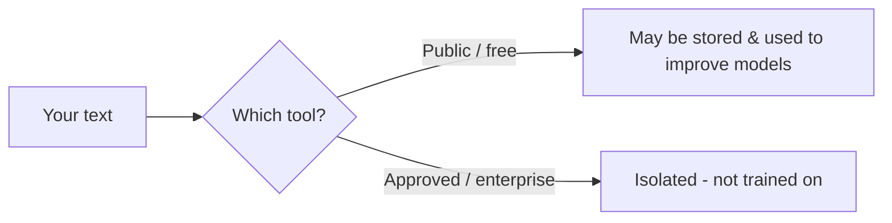
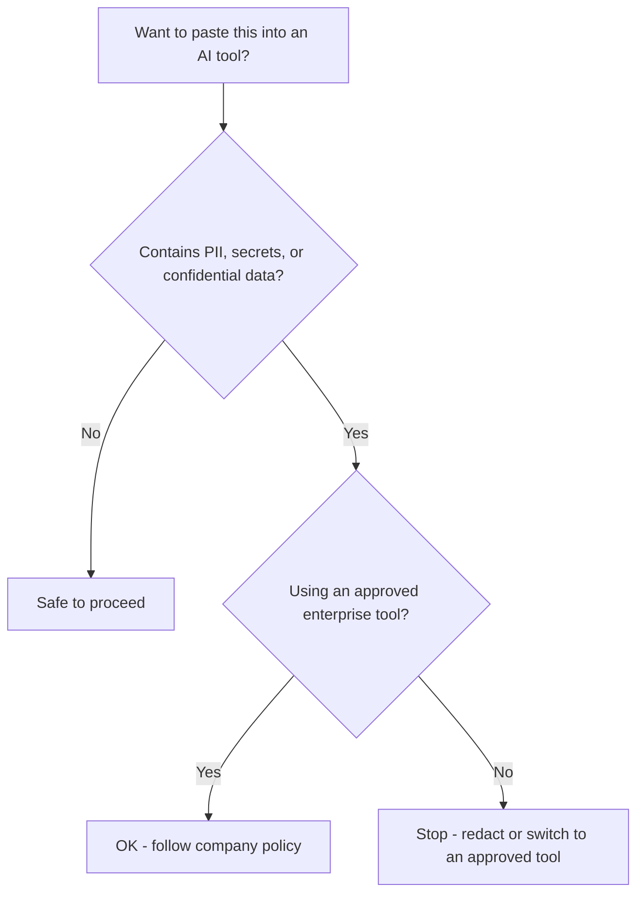

export const meta = {
  id: "1.4",
  summary: "What's safe to paste into which AI tool, recognizing PII, and practical safe patterns.",
  interactiveIds: ["paste-or-not"],
};

<Hook>
Before you paste that customer list into a public chatbot - where does that text actually go?
</Hook>

<Example title="The simple idea">

An employee pastes a confidential contract into a free consumer chatbot to &ldquo;just summarize it.&rdquo; On some consumer tiers, inputs can be retained and reviewed to improve the model. That contract now sits outside company control. Treat a public AI tool like a postcard - assume someone could read it.

</Example>

<HowItWorks>What happens to your data</HowItWorks>

### 1. Consumer vs enterprise tiers

Consumer/free tools may retain your inputs and, depending on settings, use them to improve models. Enterprise/approved tools usually carry &ldquo;no-training&rdquo; agreements, data deletion, and access controls.

<Visual caption="Same text, two very different destinations.">

</Visual>

### 2. What counts as sensitive

<Term>PII</Term> (Personally Identifiable Information), secrets, and confidential business data should never go into an unapproved tool.

<Visual caption="If a snippet contains any of these, stop and check.">

  {["Names","Emails","Phone numbers","Addresses","Government IDs","Health data","Payment data","Passwords","API keys","Source code","Contracts","Unreleased financials"].map((t) => (
    
      {t}
    
  ))}

</Visual>

### 3. The rules exist for a reason

Laws such as GDPR and CCPA govern personal data, and mishandling carries real penalties. You&rsquo;ll go deeper on this in the Legal/Risk path.

<HowItWorks>Safe patterns</HowItWorks>

- **Redact or anonymize** before pasting (swap names/numbers for placeholders).
- Use the **company-approved tool/tier** for anything non-public.
- When unsure, **ask** - or simply don&rsquo;t paste.

<Callout type="tip" title="Redaction keeps the draft, drops the risk">
Instead of &ldquo;Email john.doe@acme.com about overdue invoice 4471 for $12,300,&rdquo; paste &ldquo;Email <strong>[CUSTOMER]</strong> about overdue invoice <strong>[ID]</strong> for <strong>[AMOUNT]</strong>.&rdquo; You still get a great draft, with zero sensitive data exposed.
</Callout>

<Visual caption="The paste-or-don't decision in one glance.">

</Visual>

<Expand>

- **Data residency/sovereignty:** where data is physically stored can be a legal requirement.
- **Retention windows:** how long a vendor keeps inputs varies - check the tier.
- **&ldquo;Shadow AI&rdquo;:** staff using unsanctioned tools is a top enterprise risk - expanded in Level 3.4 and the Legal path.

</Expand>

<Interactive id="paste-or-not" />

<Quiz lessonId="1.4" />

<Recap
  items={[
    "Public tools can retain your inputs - treat them like a postcard.",
    "Never expose PII, secrets, or confidential data; know your approved tools.",
    "Redact, use approved tiers, and when unsure, ask.",
  ]}
/>
